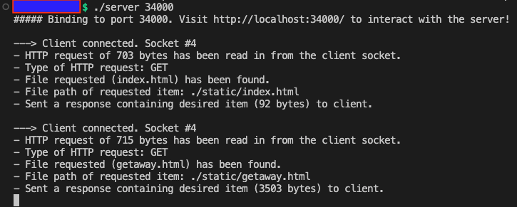

# Building a webserver in C!

This repo contains a functional webserver coded entirely from scratch in C.

This repo does not contain any third-party libs; all incoming HTTP requests have been parsed entirely manually. Structs have been used to parse the HTTP requests and responses into their respective HTTP headers.

All server responses have also been manually constructed.

Connections are made between server and client over a websocket. This server has multi-threading capabilities -- each client is given their own thread. 

The webserver here has 3 possible requests; `index.html`, `getaway.html`, and an image!

Build instructions:
- Run `make clean` just to be sure.
- Run `./server 34000` to launch the server locally on port `34000`. You can choose whatever port you like.

Below is a snippet from the command-line after a couple of client requests to the server:

